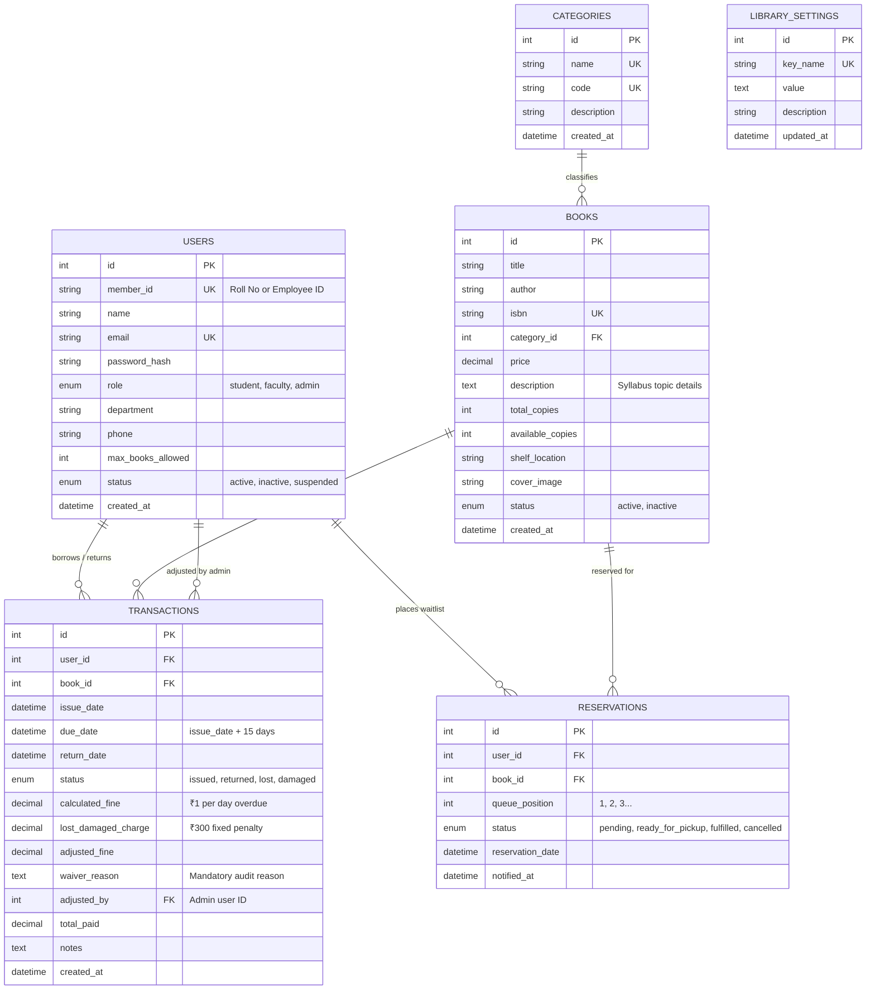

# Database Design Document: JNTUA Central Library Management System (CLMS)
**Department of Computer Science and Engineering, JNTUA CEA**

---

## 1. Entity-Relationship (ER) Diagram

---

## 2. Relational Database Normalization

### First Normal Form (1NF)
- **Atomic Values**: Every attribute holds only indivisible, single values. Multiple authors or copies are not stored as comma-separated strings.
- **Unique Primary Keys**: Every table has an explicit, unique surrogate integer primary key (`id`).
- **No Repeating Groups**: Repeating book copies are modeled via integer counts (`total_copies`, `available_copies`) and transaction instances rather than copy-1, copy-2 columns.

### Second Normal Form (2NF)
- Meets 1NF.
- **Full Functional Dependency**: No non-prime attribute is functionally dependent on a part of any candidate key. Because every table uses a single-column primary key (`id`), partial dependencies on composite keys cannot exist.

### Third Normal Form (3NF)
- Meets 2NF.
- **No Transitive Dependencies**: Non-prime attributes depend only on the primary key, not on other non-prime attributes.
  - Category details (`name`, `description`) are factored out into the `categories` table. `books` refers only to `category_id`.
  - User details (`name`, `department`, `role`) are factored out into `users`. `transactions` records only `user_id`.
  - Admin audit adjustments reference `adjusted_by` which foreign-keys back to `users(id)`.

---

## 3. Relational Integrity & Concurrency Control

### Foreign Key Constraints
- `books.category_id` $\rightarrow$ `categories.id` (`ON DELETE RESTRICT`)
  - Prevents accidental deletion of academic categories if books belong to them.
- `transactions.user_id` $\rightarrow$ `users.id` (`ON DELETE RESTRICT`)
  - Ensures borrowing records and audit histories cannot be orphaned.
- `transactions.book_id` $\rightarrow$ `books.id` (`ON DELETE RESTRICT`)
  - Ensures historical transaction logs remain authoritative even if a book is decommissioned.
- `reservations.user_id` $\rightarrow$ `users.id` (`ON DELETE CASCADE`)
  - Cleans up active waitlist entries if an account is removed.

### ACID Concurrency in Issue/Return Operations
All circulation state changes are executed inside atomic database transactions:
1. **Issue Operation**:
   - `SELECT available_copies FROM books WHERE id = ? FOR UPDATE;`
   - Check `available_copies > 0` and borrower quota.
   - `UPDATE books SET available_copies = available_copies - 1;`
   - `INSERT INTO transactions (...);`
   - `COMMIT;` (If any failure occurs, the entire state rolls back).

2. **Return Operation**:
   - Calculate overdue days and fine dynamically.
   - `UPDATE books SET available_copies = available_copies + 1;`
   - `UPDATE transactions SET status = 'returned', ...;`
   - Check `reservations` queue: if a pending reservation exists, update its status to `'ready_for_pickup'`.
   - `COMMIT;`
